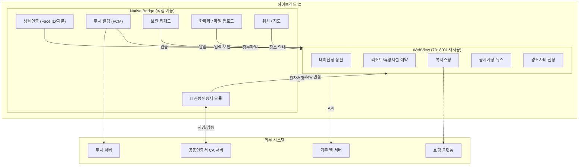

# 사례 연구: A사 모바일웹 → 하이브리드 앱 전환 검토

## 1. 서비스 개요

| 항목 | 내용 |
|------|------|
| **기관** | A사 (금융복지 법인, 임직원 전용 복지몰 운영) |
| **현재 채널** | 모바일웹 (m.도메인) |
| **서비스 대상** | 소속 임직원 한정 폐쇄형 복지서비스 |
| **주요 기능** | 대여신청·상환, 퇴직공제급여조회, 리조트예약, 제휴휴양시설예약, 경조사비 신청, 복지쇼핑 |

## 2. 전환 검토 배경

A사는 현재 모바일웹으로 복지서비스를 운영 중이나, 다음과 같은 과제를 해결하기 위해 하이브리드 앱 전환을 검토하고 있습니다.

### 현재 모바일웹의 한계

| 문제 영역 | 구체적 현상 |
|----------|-------------|
| **진입 마찰** | 매번 브라우저 실행 → URL 입력/검색 → 로그인 (세션 만료 시 재로그인) |
| **알림 부재** | 대여 상환일, 예약 확정, 경조사비 안내 등을 푸시로 전달 불가 |
| **홈화면 접근** | 북마크 의존, 경로 복잡으로 재방문 시 이탈 발생 |
| **기기 기능** | 리조트 예약 시 지도/위치, 쇼핑 시 카메라/결제 등 네이티브 기능 제한 |
| **공동인증서** | 모바일웹 브라우저에서는 공동인증서(구 공인인증서) 설치·호출 불가 → 별도 앱 필요 |

### 전환 기대 효과

| 기대 영역 | 내용 |
|----------|------|
| **진입 편의** | 홈화면 아이콘 탭 1회 + 생체인증으로 3초 이내 로그인 |
| **푸시 알림** | 상환 알림, 예약 확정, 신규 복지서비스 안내 등 적극적 소통 |
| **보안 강화** | 보안 키패드, 세션 관리, 금융정보 조회 시 추가 인증 |
| **이용 증대** | 접근성 개선으로 재방문율 및 서비스 이용 건수 상승 |

## 3. 하이브리드 앱 전환 적정성 분석

### 판단 기준 분석

| 기준 | 분석 결과 | 적합도 |
|------|----------|--------|
| **공동인증서** | 모바일웹에서는 공동인증서 설치·호출 불가 → 네이티브 브릿지 필수 | ⭐⭐⭐⭐⭐ **(핵심)** |
| **재방문 빈도** | 복지서비스(대여·예약·조회)는 반복 이용 패턴 예상 | ⭐⭐⭐⭐ |
| **로그인 마찰** | 매번 모바일웹 접속 시 로그인 필요 → 생체인증으로 대폭 개선 | ⭐⭐⭐⭐ |
| **푸시 알림** | 대여 상환 알림, 예약 확정, 경조사비 안내 등 알림성 메시지 다수 | ⭐⭐⭐⭐ |
| **폐쇄형 사용자** | 임직원 한정 → 설치 유도 및 관리 용이 | ⭐⭐⭐⭐⭐ |
| **기기 기능** | 지도/위치, 카메라/결제, 파일업로드 등 부분적 활용 | ⭐⭐⭐ |
| **홈화면 상주** | 복지서비스 빠른 접근 필요 → 아이콘 탭 1회로 직행 | ⭐⭐⭐⭐ |

### 전환 방식 판단

| 대안 | 적합성 | 비고 |
|------|--------|------|
| 모바일웹 고도화 | ⭐⭐ | 진입 마찰 해소 불가 |
| PWA | ⭐⭐ | iOS 푸시 제한, 생체인증 제한 |
| 앱 래핑(WebView) | ⭐⭐⭐ | 설치·푸시 가능하나 보안·성능 한계 |
| **하이브리드 앱** | ⭐⭐⭐⭐⭐ | **WebView 재사용 + 핵심 기능 브릿지 최적안** |
| 크로스플랫폼 | ⭐⭐⭐ | 기능 풍부하나 개발비 과다 |
| 네이티브 | ⭐⭐ | 비용·기간 대비 과잉 |

> **결론**: 하이브리드 앱 전환 적정함 ✅
>
> 기존 모바일웹 재사용(70~80%) + 생체인증·푸시·보안 키패드 등 핵심 기능만 네이티브 브릿지로 보완

## 4. 권장 전환 시나리오

### 아키텍처

### 예상 비용 및 기간

| 항목 | 예상 규모 | 비고 |
|------|----------|------|
| **구축 비용** | 0.5억 ~ 0.8억 (WebView 기반 재사용 기준) | 공동인증서 브릿지 포함 |
| **공동인증서 모듈** | 별도 산정 (아래 추가 자료 제공 후 확정) | CA사 라이선스 + 네이티브 개발 |
| **개발 기간** | 2 ~ 3개월 | 인증서 연동 시 +2주 추가 가능 |
| **연간 운영비** | 구축비의 15~20% | 인증서 갱신·CA 서버 비용 별도 |

### 추진 로드맵

| 단계 | 내용 | 기간 |
|------|------|------|
| **1단계** | 기존 모바일웹 분석 및 재사용 범위 선정 | 2주 |
| **2단계** | 하이브리드 앱 프로토타입 개발 (WebView + 브릿지) | 4주 |
| **3단계** | 보안·푸시·생체인증·**공동인증서** 통합 및 QA | 3주 |
| **4단계** | 임직원 베타 테스트 → 피드백 반영 | 2주 |
| **5단계** | 정식 출시 (사내 배포 또는 스토어 등록) | 1주 |

## 5. 리스크 및 대응책

| 리스크 | 영향도 | 대응책 |
|--------|--------|--------|
| **낮은 설치율** | 앱 미설치로 효과 미미 | 사내 홍보, 설치 인센티브, 필수 서비스 앱과 번들 |
| **보안 사고** | 금융정보 유출 가능성 | 보안 키패드, 구간 암호화, 앱 위변조 체크 적용 |
| **OS 업데이트** | 호환성 이슈 발생 | 분기별 테스트, 긴급 패치 체계 구축 |
| **기존 앱과 중복** | 기존 복지쇼핑 앱과 기능 중복 | 통합 운영 또는 역할 분리(복지몰 vs 쇼핑) |

## 6. 추가 수집 필요 데이터

적정 판단의 정확도를 높이기 위해 아래 자료가 필요합니다.

### 6-1. 인증·공동인증서 관련 (비용 산정 핵심)

| 우선순위 | 필요 자료 | 용도 |
|---------|----------|------|
| 🔴 **필수** | 현재 사용 중인 인증 방식 (공동인증서, 간편인증, ID/PW 등) | 네이티브 브릿지 개발 범위 결정 |
| 🔴 **필수** | 공동인증서 이용 서비스 목록 (어떤 기능에서 인증서 서명 필요한가) | 브릿지 모듈 개발 비용 산정 |
| 🔴 **필수** | 월간 공동인증서 호출 건수 및 평균 응답 시간 | 푸시 서버·인증 서버 성능 요구사항 |
| 🟡 **권장** | 인증서 발급·갱신·폐지 건수 (월간) | 인증서 관리 기능 개발 범위 |
| 🟡 **권장** | 인증 실패율 및 실패 유형 (만료, 미설치, 호환성 등) | 앱 전환 시 개선 효과 산정 |
| 🟢 **참고** | 타 기관 유사 인증 시스템 도입 사례 | 벤치마킹 기준 |

### 6-2. 일반 운영 데이터

| 우선순위 | 필요 자료 | 용도 |
|---------|----------|------|
| 🔴 **필수** | 월간 모바일웹 접속자 수(UA) 및 PV | 앱 전환 시 기대 설치 수 추정 |
| 🔴 **필수** | 모바일 로그인 빈도 및 재인증 비율 | 진입 마찰 개선 효과 산정 |
| 🔴 **필수** | 서비스별 이용 비중 | 핵심 기능 우선순위 결정 |
| 🟡 **권장** | 사용자 재방문 빈도 (주간/월간) | 앱 필요성 지표 |
| 🟡 **권장** | 푸시 알림 필요 이벤트 목록 및 월 발생 건수 | 푸시 서버 구성 비용/효익 산정 |
| 🟢 **참고** | 기존 복지쇼핑 앱 설치자 수 및 이용 통계 | 통합 vs 별도 운영 결정 |
| 🟢 **참고** | 임직원 총수 및 모바일 이용률 | 잠재 설치 수 파악 |

> **공동인증서 관련 자료가 비용 산정의 핵심**입니다. 인증서 기반 서비스의 범위와 빈도에 따라 네이티브 브릿지 개발 비용이 크게 달라집니다.
